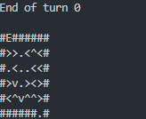

⭐ ⭐ ⭐ ⭐ ⭐ ⭐ ⭐ ⭐ ⭐ ⭐ ⭐ ⭐ ⭐ ⭐ ⭐ ⭐ ⭐ ⭐ ⭐ ⭐ ⭐ ⭐ ⭐ ⭐ ⭐

# advent-of-code-2022

My solutions for all 25 problems of the [2022 Advent of Code](https://adventofcode.com/2022) challenge. It was my first time participating, and I learned incredibly much!

## Goals

- Typescript
- 0 dependencies used for solving the problems, only for tooling

## Highlights



## Getting started

`Node 18` needs to be installed.

```sh
# Install dependencies
npm i

# Run day 1
npm run day 1 -- --file=input-01.txt

# Run day 1 in watch mode
npm run watch-day 1 -- --file=input-01.txt

# Run day 1 with test inputs
npm run day 1 -- --file=input-test-01.txt

# Run day 1 with cli input
npm run day 1 -- --cliInput=abcdefg

# Print visualizations
npm run day 1 -- --visualize=true
```

🎅 🎄 🎁 🎅 🎄 🎁 🎅 🎄 🎁 🎅 🎄 🎁 🎅 🎄 🎁 🎅 🎄 🎁
